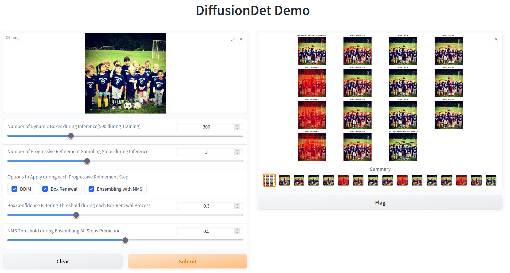

# Demonstration App for `DiffusionDet` with Denoising Process Visualization

This is just a simple demo application built by [Gradio](https://gradio.app/).



## Environment Preparation

You can just refer to [DiffusionDet](https://github.com/ShoufaChen/DiffusionDet/blob/main/GETTING_STARTED.md#installation) for basic environment preparation, where we just add gradio package additionally.

Specifically,

```Shell
conda create -n diffusiondet python=3.7
conda activate diffusiondet
pip install 'git+https://ghproxy.com/https://github.com/facebookresearch/detectron2.git'
pip install gradio
# In Linux, prepare model weights by
mkdir models && wget https://github.com/ShoufaChen/DiffusionDet/releases/download/v0.1/diffdet_coco_swinbase.pth ./models/
# In Windows, prepare model weights manually
```

Otherwise, you can just use our docker image hosted on AliYun, and the correponding Dockerfile is located at [here](https://github.com/XIRZC/diffusiondet.demo/blob/main/Dockerfile).

```Shell
docker pull registry.cn-hangzhou.aliyuncs.com/mrxir/diffusiondet.demo:model-executable-v2.0
```

## Usage

By local environment:

- In Linux, just run `./gradio_demo.sh` under this repo root directory.
- In Windows, just run `python gradio_demo.py` under created diffusiondet conda virtual environment

By docker container:

Just run `docker run -it --rm -p 7860:7860 registry.cn-hangzhou.aliyuncs.com/mrxir/diffusiondet.demo:model-executable-v2.0` in any OS terminal with docker installed.

After deploy the gradio web application, you can just enter your [localhost](http://127.0.0.1:7860) in browser.
